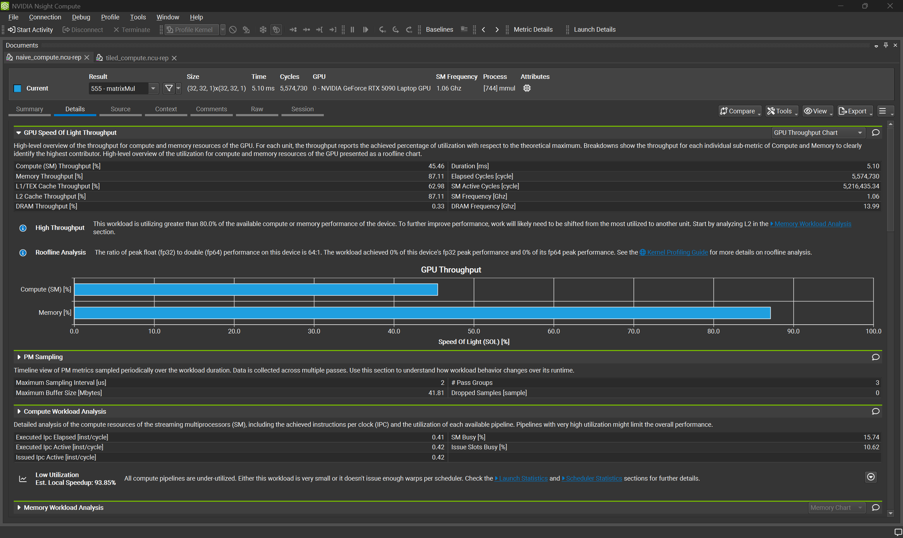
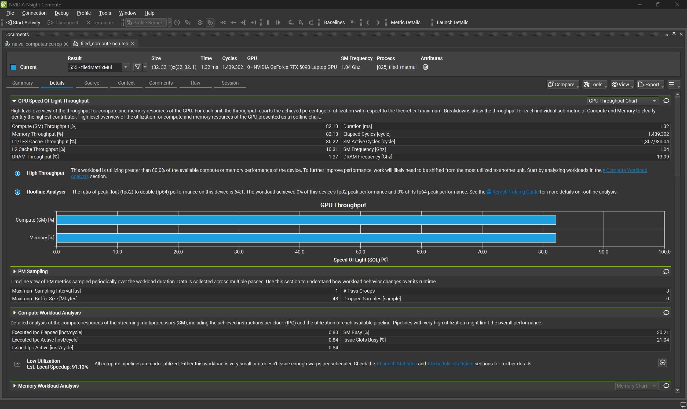
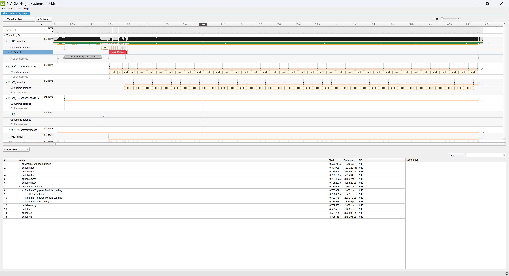
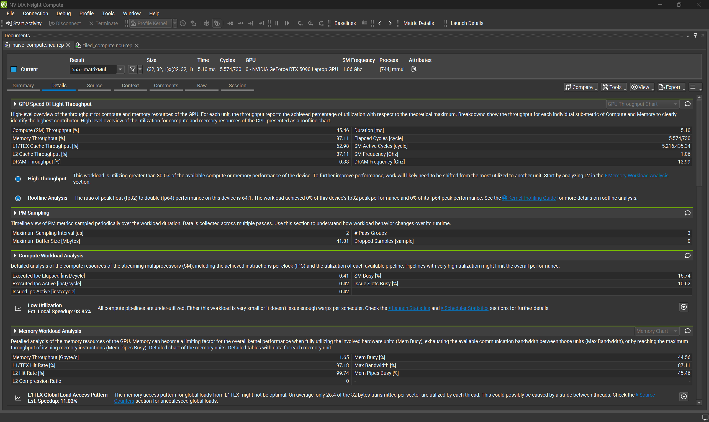
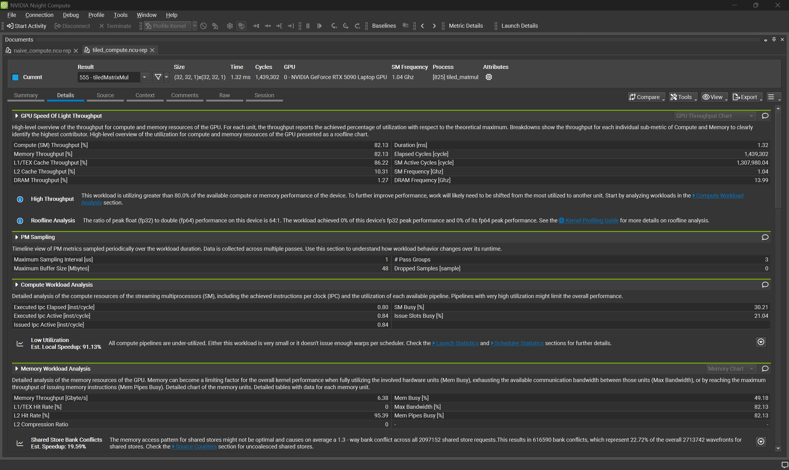
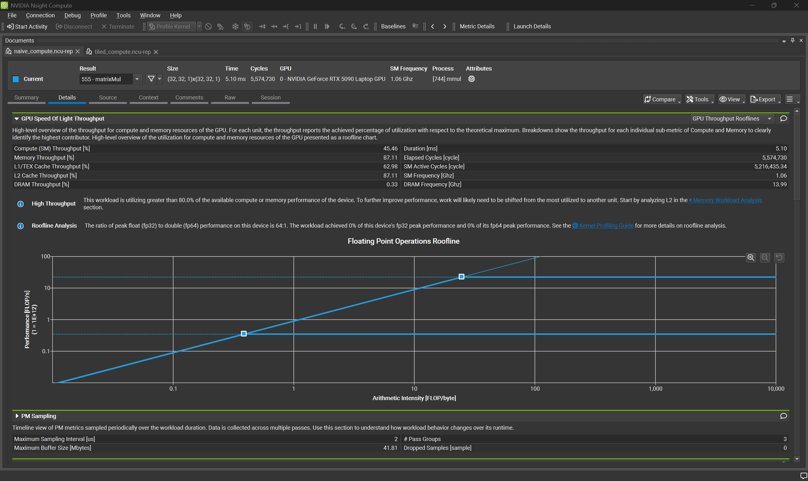
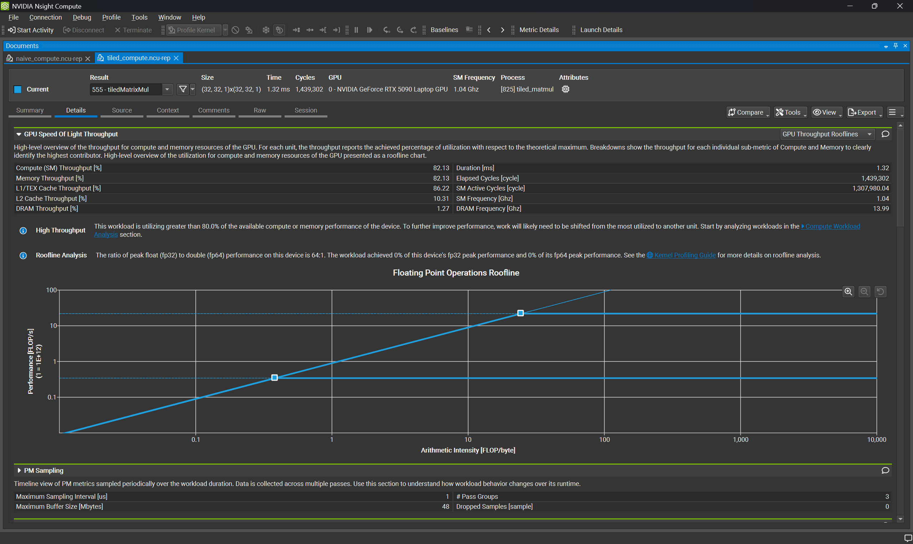

# Matrix Multiplication Kernel (Before/After)
<h1 align="center">

</h1> 

I built and profiled a CUDA matrix multiplication kernel, starting from a naive baseline and optimizing it with shared memory tiling. This project documents the full diagnostic process: identifying why the naive version was slow, applying a specific fix, and proving the improvement with real profiling data instead of just claiming it worked.

**Result: 5.10 ms to 1.32 ms, a 3.86x speedup, driven by moving the kernel from memory bound to compute bound.**

| Naive | Tiled |
|---|---|
|  |  |

## Project Structure / Architecture

I developed this in Visual Studio Code with the CUDA Toolkit installed under WSL2 Ubuntu. My diagnostic pipeline followed this order:

```
CUDA kernel (VS Code)
       |
       v
Nsight Systems     (timeline view, finds where time goes across the whole run)
       |
       v
Nsight Compute     (kernel level detail, finds why a specific kernel is slow)
```

I used Nsight Systems first to confirm the matmul kernel was the dominant cost in the run and to check the sequence of CUDA API calls around the launch. I then used Nsight Compute to look inside the kernel itself, at throughput, the roofline position, and memory access behavior.

## Methodology

I started with a naive matmul kernel, where each thread computes one output element by looping over the shared dimension and reading directly from global memory on every iteration. I profiled this baseline with Nsight Systems and Nsight Compute to establish where its performance limits actually came from.

Based on that profile, I rewrote the kernel using shared memory tiling. Threads within a block cooperatively load a tile of each input matrix into shared memory once, then reuse that data for their computations instead of each thread independently re-fetching the same values from global memory repeatedly. I re-ran the same profiling pass on the tiled version to measure the actual difference.

Both versions were verified for correctness against an independent CPU implementation before any performance comparison was made.

One methodology note worth stating directly: my first look at Nsight Systems showed the tiled kernel's `cudaLaunchKernel` duration at roughly 209 ms, far higher than the naive kernel's 3.9 ms. Expanding that event revealed the difference was almost entirely one time JIT compilation of the more complex tiled kernel, not execution time. Nsight Systems measures host side API duration, which includes that first call compilation cost. Nsight Compute measures kernel execution directly on the device, which is unaffected by JIT compilation. All performance comparisons in this README use Nsight Compute's Duration metric for this reason.

## Results / Evidence

### Nsight Systems: CUDA API event sequence

| Naive | Tiled |
|---|---|
|  |  |

### Nsight Compute: summary and throughput

| Naive | Tiled |
|---|---|
|  |  |

### Nsight Compute: roofline

| Naive | Tiled |
|---|---|
|  |  |

### Summary table

| Metric | Naive | Tiled |
|---|---|---|
| Duration | 5.10 ms | 1.32 ms |
| Compute (SM) Throughput | 45.46% | 82.13% |
| Memory Throughput | 87.11% | 82.13% |
| L2 Cache Throughput | 87.11% | 10.31% |

## Key Findings

The naive kernel was memory bound. Nsight Compute flagged this directly under Memory Workload Analysis: its L1TEX Global Load Access Pattern check found that only 26.4 of the 32 bytes transmitted per memory sector were actually used by each thread, meaning the naive kernel's global memory reads were uncoalesced. Every iteration of its inner loop reads directly from global memory, and neighboring threads in the same block were reading largely overlapping data without sharing any of it.

The tiled kernel performs the same total amount of arithmetic. What changes is how often it touches global memory. By having each thread contribute one value to a shared tile, then having the whole block reuse that tile for multiple computations, global memory traffic dropped substantially. Compute throughput rose from 45.46% to 82.13%, and L2 cache throughput fell from 87.11% to 10.31%, which is the direct signature of traffic that used to hit global memory now being served from fast on chip shared memory instead. Kernel duration dropped from 5.10 ms to 1.32 ms, a 3.86x speedup.

One note on the roofline charts: both kernels operate on integer data, not floating point, which is why the standard Floating Point Operations Roofline reports 0% of fp32 and fp64 peak performance in the summary text. The plotted points still reflect real achieved performance and arithmetic intensity for this workload, just outside the model's usual floating point framing.

<details>
<summary>A plainer language explanation of what changed</summary>

Picture a kitchen with 1,024 cooks, each cook assigned to plate one dish. Every ingredient a cook needs lives in the walk-in pantry at the back of the kitchen. In the naive version, each cook walks to the pantry alone for every single ingredient in their recipe, one trip per ingredient, even though the cook working right next to them needs almost the exact same ingredients and just made the same walk.

In the tiled version, cooks are grouped into small stations. Each station gets its own prep counter close by. Instead of every cook walking to the pantry alone, each cook at the station grabs one ingredient and sets it on the shared counter. Once the whole counter is stocked, everyone at that station cooks using what is already sitting right there, no more long pantry trips for a while. The station then goes back together for the next batch of ingredients and repeats.

The total amount of cooking is identical between the two versions. What changes is how many trips to the pantry it took to gather the ingredients.

</details>

## Design Notes

I chose shared memory tiling specifically because it directly addresses what the baseline profiling showed, rather than applying a generic optimization and hoping it helped. The tile size matches the block dimensions I launched with, since each thread is responsible for loading exactly one element into the shared tile.

I used `__syncthreads()` twice inside the kernel. The first call ensures every thread in the block has finished writing its element into the shared tile before any thread starts reading from it. The second call ensures every thread has finished using the current tile before any thread starts overwriting it with the next one. Without either barrier, threads could read a partially loaded tile or read from a tile that is being overwritten mid-use, producing incorrect results.

I verified correctness against a CPU implementation for both kernel versions before comparing performance, since a faster kernel that produces wrong answers is not actually an improvement.

## Getting Started / Reproduction

Requirements:
- NVIDIA GPU with current drivers
- CUDA Toolkit installed
- Nsight Systems and Nsight Compute installed

```bash
git clone https://github.com/Dre1896/Matrix-Multiplication-Kernel.git
cd Matrix-Multiplication-Kernel
nvcc mmul.cu -o mmul
nvcc tiled_matmul.cu -o tiled_matmul
```

To profile either version:

```bash
nsys profile -o naive_systems ./mmul
ncu -o naive_compute --set full ./mmul

nsys profile -o tiled_systems ./tiled_matmul
ncu -o tiled_compute --set full ./tiled_matmul
```

Open the resulting `.nsys-rep` files in Nsight Systems and `.ncu-rep` files in Nsight Compute to view the full reports. Raw report files are not included in this repository, this repo includes exported screenshots and summarized findings for readability. Raw reports are available on request.

## Next Steps

- Address shared memory bank conflicts in the tiled kernel. Nsight Compute flagged a 1.3-way bank conflict across shared store requests, costing an estimated 22.72% of shared store wavefronts, with roughly 19.59% further speedup available. This is most commonly fixed by padding the shared memory tile dimensions to avoid bank alignment collisions.
- Apply the same DCGM, Nsight Systems, and Nsight Compute diagnostic chain to a different kernel to confirm the process generalizes beyond matrix multiplication.
- Compare this hand written CUDA approach against an OpenACC directive based version of the same kernel.

## Acknowledgments

Special thanks to CoffeeBeforeArch for the naive matrix multiplication kernel, which served as the starting baseline before I optimized it through shared memory tiling. The optimization, profiling, and analysis work in this repository are my own.

## License

MIT, see LICENSE.
